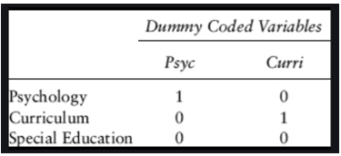

# Simple and multiple linear regression

This document recaps how we assess relationships between variables when at least the outcome variable is continuous.

```{r message=FALSE, warning=FALSE}
pacman::p_load(tidyverse)
```

## Simple linear regression

For an introduction to simple linear regression and correlation, watch this video:
`r video_code("uoMjSFApBTY")`

When considering the relationship between two continuous variables, we should always start with a scatterplot - for example, of the relationship between social trust and life satisfaction at the national level in European countries (data from the European Social Survey 2014).

```{r, fig.cap="Scatterplot relating social trust to life satisfaction"}
#Data preparation
ess <- read_rds(url("http://empower-training.de/Gold/round7.RDS"))
ess <- ess %>% mutate(soctrust = (ppltrst + pplfair + pplhlp)/3)
nat_avgs <- ess %>% group_by(cntry) %>% 
  summarize(nat_soctrust = mean(soctrust, na.rm=T), 
            nat_stflife = mean(stflife, na.rm=T))

ggplot(nat_avgs, aes(x=nat_soctrust, y=nat_stflife)) + geom_point()

```

The scatterplot can now help us to think about what kind of model would help us to explain or predict one variable based on the other. If a straight-line relationship seems reasonable, we can use a linear model.

### Plotting a simple linear regression model

Geometrically, a simple linear regression model is just a straight line through the scatterplot, fitted in a way that minimises the distances from the points to the line. It can be fitted with the `geom_smooth(method="lm")` function.

```{r, fig.cap='Scatterplot with added regression line ("line of best fit")'}
ggplot(nat_avgs, aes(x=nat_soctrust, y=nat_stflife)) + 
  geom_point() + geom_smooth(method="lm", se=FALSE) 
    #se=FALSE hides confidence bands that are often just visual clutter
```

For each value of one variable, this line now allows us to find the corresponding expected value of the other variable.

### Mathematical representation of a simple linear regression model

The idea of a simple linear regression model is to link one predictor variable, $x$, to an outcome variable, $y$. Their relationship can be expressed in a simple formula:
$$y=\beta_{0} +  \beta_{1}*x$$
Here, **$\beta_{1}$ is the most important parameter** - it tells us, how much a change of 1 in the $x$-variable affects the $y$-variable. Geometrically, it is the slope of the regression line. $\beta_{0}$ is the intercept of that line, i.e. the value of $y$ when $x$ is 0 - since $x$ can often not be zero, that parameter tends to be of little interest on its own.

### Fitting a simple linear regression model in R

Linear models are fitted in R using the `lm()` function. The model itself is specified as a formula with the notation `y ~ x` where the `~` means 'is predicted by' and the intercept is added automatically.

```{r}
lm(nat_stflife ~ nat_soctrust, data = nat_avgs) %>% summary()
```

In the summary, the first column of the coefficients table gives the estimates for 
$\beta_{0}$ (in the intercept row) and $\beta_{1}$ (in the nat_soctrust row). Thus in this case, the regression formula could be written as:

$$LifeSatisfaction = 2.76 +  0.80 * SocialTrust$$
Clearly this formula does not allow us to perfectly predict one variable from the other; we have already seen in the graph that not all points fall exactly on the line. The distances between each point and the line are the **residuals** - their distribution is described at the top of the `summary()`-function output. 

#### Interpreting $R^2$

The model output allows us to say how well the line fits by considering the $R^2$ value. It is based on the sum of the squares of the deviations of each data point from either the mean ($SS_{total}$) or the model($SS_{residual}$).

If I was considering a model that predicted people's height, I might have a person who is 1.6m tall. If the mean of the data was 1.8m, their squared total deviation would be $0.2*0.2 = 0.04$. If the model then predicted their height at 1.55m, their squared residual deviation would be $-0.05*-0.05 = 0.025$. Once this is summed up for all data points, $R^2$ is calculated with the following formula: 
$$R^2 = 1 - \frac{SS_{residual}}{SS_{total}}$$

Given that the sum of squared residuals can never be less than 0 or more than the sum of the total residuals, $R^2$ can only take up values between 0 and 1. It can be understood as the share of total variance explained by the model (or to link it to the formula: as the total variance minus the share *not* explained by the model).

#### Interpreting Pr(>|t|), the *p*-value

Each coefficient comes with an associated *p*-value in the summary that is shown at the end of the row. As indicated by the column title, it indicates the probability that the test statistic would be this large or larger *if* the null hypothesis was true and there was no association in the underlying population.

As per usual, we would typically report coefficients with a *p*-value below .05 as statistically significant. The significance level for the intercept is almost never relevant and thus not reported (it simply tests whether the value of y would be different from 0 when x is zero, which is rarely of particular interest).

## Bivariate correlation

Simple linear regression can tell us whether two variables are linearly related to each other, whether this finding is statistically significant (i.e. unlikely to have arisen due to change), and how strong the relationship is *in terms of the units of the two variables.* Quite often, however, we would prefer a standardised measure of the strength of a relationship, and a quicker test. That is where correlation comes in.

The **Pearson's correlation coefficient** is the slope of the regression line when both variables are standardised, i.e. expressed in units of their standard deviations (as so-called Z-scores). It is again bounded, between -1 and 1, and as it is unit-free, it can give quick information as to which relationships matter more and which matter less.

### Calculating the correlation coefficient

Before calculating a correlation coefficient, **you need to look at the scatterplot and make sure that a straight-line relationship looks reasonable.** If that is the case, you can use the `cor.test()` function to calculate the correlation coefficient.

```{r}
cor.test(nat_avgs$nat_soctrust, nat_avgs$nat_stflife) 
#If you have missing data, use the na.rm = TRUE argument to have it excluded before the calculation
```

The estimated cor at the very bottom is the correlation coefficient, usually reported as *r* = .81. This shows that there is a strong positive relationship between the two variables. Check the *p*-value to see whether the relationship is statistically significant and the 95%-confidence interval to see how precise the estimate is likely to be.

### Equivalence to linear regression

Just to show that this is indeed equivalent to simple linear regression on the standardised variables, which can be calculated using the `scale()`-function.

```{r, fig.cap="Scatterplot with scales variables (Z-scores)"}
ggplot(nat_avgs, aes(x=scale(nat_soctrust), y=scale(nat_stflife))) + 
  geom_point() + geom_smooth(method="lm", se=FALSE)

lm(scale(nat_stflife) ~ scale(nat_soctrust), data = nat_avgs) %>% summary()

```

Note that the regression coefficient for the scaled variable is now exactly identical to the correlation coefficient shown above.

## Multiple linear regression

Linear models can easily be extended to multiple predictor variables. Here I will focus on a few key points that particularly focus on linear models that include categorical predictor variables.

You can watch this video to take you through the process of extending simple linear regression to include multiple variables step-by-step:

`r video_code("6lcDzTlsGVE")`


### Dummy coding revisited

Multiple linear regression models often use categorical predictors. However, they need to be turned into numbers. This is done through automatic dummy coding, which creates variables coded as 0 and 1. 

Note that dummy coding always results in **one fewer dummy variable than the number of levels of the categorical variable**. For example, a gender variable with two levels (male/female) would be recoded into a single dummy variable *female* (0=no, 1=yes). Note that there is no equivalent variable *male* as that would be redundant. Given that the hypothetical gender variable here is defined as either male or female, not female necessarily implies male.

The same applies to larger number of levels - see below how three possible values for the department variabel can be recoded into two dummy variables.

```{r img-dummy-coding, echo=FALSE, fig.cap="Example for dummy-coding"}



```


The level that is not explicitly mentioned anymore is the **reference level** - in the case above, that is Special Education. In a linear model, that is what all other effects are compared to, so it is important to keep in mind which that is.

### Mathematical structure of multiple linear models

Linear models are characterised by intercepts and slopes. Geometrically, intercepts shift a line or plane along an axis, while a slope changes its orientation in space. Conceptually, intercepts are like on/off switches, while slopes indicate what happens when variables are dialed up or down.

For example, we might want to predict life expectancy based on a person's gender and their level of physical activity. Then the model would be 

$$LifeExpectancy=\beta_{0} +  \beta_{1}*female + \beta_{2}*activity$$
$\beta_{0}$ here would describe the notional life expectancy of males without any activity, $\beta_{0}+\beta_{1}$ would describe that of females without any exercise - so both of these are intercepts, the $female$ variable simply determines which intercept we choose. $\beta_{2}$ is now the effect of each unit of activity, i.e. the slope of the regression line.

### Running multiple linear regression models in R

In the `lm()`-function, it is very easy to keep on adding predictors to the formula by just using the `+`-symbol. For example, we can consider the UK General Election Results in 2019 and see what helps explain the vote share of the Conservatives.

```{r}
#Load and prep data
constituencies <- read_csv(url("http://empower-training.de/Gold/ConstituencyData2019.csv"), col_types = "_cfddddfffddddfffdfdddd")
constituencies <- constituencies %>% filter(RegionName != "Northern Ireland") %>%
          mutate(nation = case_when(RegionName == "Scotland" ~ "Scotland",
                                    RegionName == "Wales" ~ "Wales",
                                    T ~ "England"))  %>% 
          filter(ConstituencyName != "Chorley")

#Simple linear regression model:
lm(ElectionConShare ~ MedianAge, data = constituencies) %>% summary()

```

We now know that the Conservative vote share seems to be strongly related to the median age of the constituency, and can find and interpret the coefficient estimate (1.7 pct-points per year of median age), significance value and $R^2$ as above. What happens when we add nation, to account for differences between Scotland, England and Wales?

```{r}
#Declare nation as factor and then set the reference level for categorical predictors
constituencies$nation <- factor(constituencies$nation) %>% relevel(ref = "England")
lm(ElectionConShare ~ MedianAge + nation, data = constituencies) %>% summary()
```

Now we have a more complex model. Based on the coefficient estimates, we would now estimate the vote share as follows
$$VoteShare=-0.27 +  0.018*age + -0.25*Scotland + -0.15*Wales$$
The figures for Scotland and Wales need to be compared to the unnamed reference level, i.e. to England - so we would expect a Scottish constituency to have a 25 percentage points lower Conservative vote share *when keeping median age constant.* Likewise, we now would expect an increase of the median age by 1 year to increase the Conservative vote share by 1.8 percentage points, *keeping the effect of nation constant.*

#### Significance testing and reporting in multiple regression models

With more than one predictor, we have two questions: 

* is the **overall model** significant, i.e. can we confidently believe that its estimates are better than if we just took the overall mean as our estimate for each constituency? That is shown in the last line of the summary. Here we would report that the regression model predicting the conservative vote share per constituency based on its median age and the nation it was located in was significant, with *F*(3, 627) = 244.6, *p* < .001, and explained a substantial share of the variance, $R^2$ = .54.
* does **each predictor** explain a significant share of unique variance? That is shown at the end of each line in the coefficients table, with many predictors it would usually be reported in a table.

