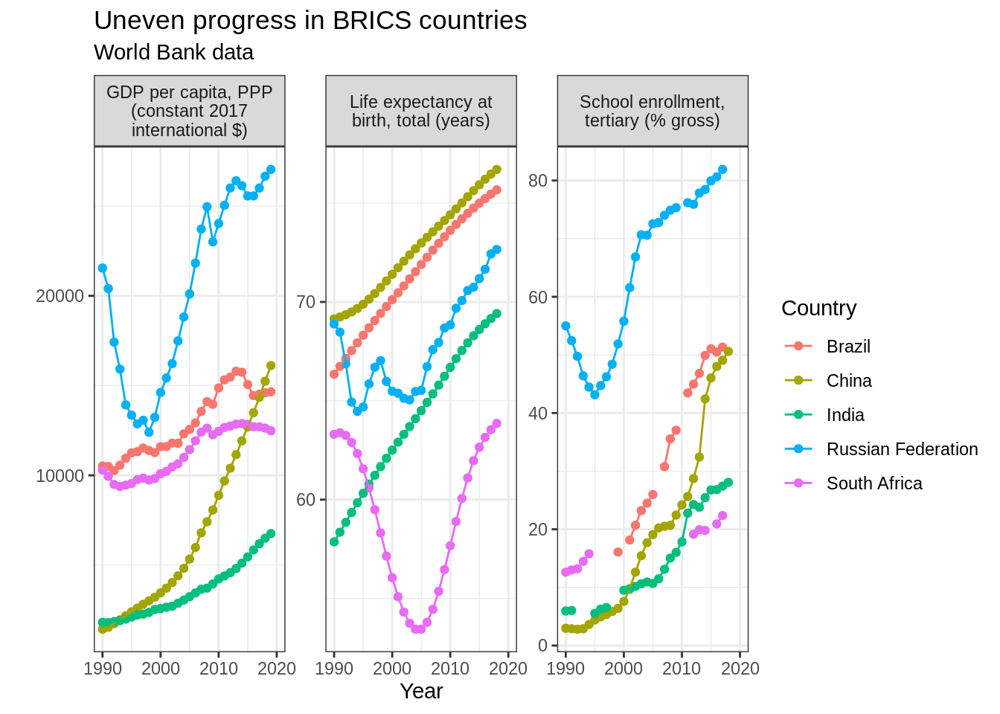

# Accessing online data sources

This section introduces some examples of R packages that allow you to access large secondary datasets. They are often a good way to understand wider trends, and thereby provide a high-level justification for doing research into a specific question. However, they can also be data sources for research projects in their own right.


```r
pacman::p_load(tidyverse)
```


## World Bank data

The World Bank offers a rich dataset with a particular focus on indicators relevant for the study of poverty, inequality and global development (in fact, much of gapminder is based on World Bank data). You can explore their data online on [data.worldbank.com](https://data.worldbank.com), or access it directly from R using the `wbstats` package.

Here, I will explore the question whether life expectancy and literacy have increased in line with GDP in the BRICS countries (Brasil, Russia, India, China and South Africa, a group that has often been seen as representing emerging economies).


```r
pacman::p_load(wbstats)

#Download current list of indicators
new_wb_cache <- wb_cache()

#Search for indicators - you can best do this on data.worldbank.com and find the IndicatorID in the URL. The wbsearch() function often returns to many hits.

#GDP per capita, purchasing power adjusted (to remove effect of exchange rates)
wb_search("gdp.*capita.*PPP", cache = new_wb_cache)
```

```
## # A tibble: 4 x 3
##   indicator_id    indicator                indicator_desc                       
##   <chr>           <chr>                    <chr>                                
## 1 6.0.GDPpc_cons… GDP per capita, PPP (co… GDP per capita based on purchasing p…
## 2 NY.GDP.PCAP.PP… GDP per capita, PPP (cu… This indicator provides per capita v…
## 3 NY.GDP.PCAP.PP… GDP per capita, PPP (co… GDP per capita based on purchasing p…
## 4 NY.GDP.PCAP.PP… GDP per capita, PPP ann… Annual percentage growth rate of GDP…
```

Once we know the names of the indicators, we can download them.


```r
#Note: to get the country names, you can download all countries once and then check the names
#wb_dat <- wb(indicator = c("NY.GDP.PCAP.PP.KD", "SI.POV.GINI"), country = "all")
#wb_dat %>% count(iso2c, country) %>% view()            
                            
wb_dat <- wb_data(indicator = c("NY.GDP.PCAP.PP.KD", "SP.DYN.LE00.IN", "SE.TER.ENRR"), 
             country = c("IN", "BR", "CN", "ZA", "RU"), return_wide = FALSE)
```

Now we have the data in a "long" format - with one combination of countries, indicators and years per row. That is a good layout for plotting, for other analyses you would need to reshape the data into a wide format where each indicator is in its own variable - look for the spread() function if you need that.

A simple way of comparing the data is plotting the indicators side-by-side. One interesting take-away is that Brazil massively improved life expectancy and expanded education, even though  GDP growth was rather modest, while South Africa stagnated in comparison.


```r
#Our GDP series only starts in 1990 - so it does not make sense to consider earlier life expectancy
wb_datF <- wb_dat %>% filter(as.numeric(date)>=1990)

ggplot(wb_datF, aes(x=as.numeric(date), y=value, col=country)) + 
  geom_point() + geom_line() + 
  facet_wrap(.~indicator, scales = "free", labeller = labeller(indicator = label_wrap_gen(25))) +
  #scales = "free" means that each indicator has its own y-axis, the labeller() function is needed for line breaks in the facet titles
  labs(title = "Uneven progress in BRICS countries", subtitle = "World Bank data", 
       x = "Year", y="", col = "Country")
```

```
## Warning: Removed 64 rows containing missing values (geom_point).
```

```
## Warning: Removed 13 row(s) containing missing values (geom_path).
```

<div class="figure" style="text-align: center">

<p class="caption">(\#fig:unnamed-chunk-4)Example plot from World Bank data</p>
</div>

You can find a similar but slightly more detailed example for how to use the package [here](https://cengel.github.io/gearup2016/worldbank.html) and very clear instructions in the the full [README file of the package](https://github.com/nset-ornl/wbstats/blob/master/README.md).


## Wikidata

Wikidata is where most data from Wikipedia and much else lives. So if there are Wikipedia articles on the topic you are interested in, you can likely find underlying data on Wikidata. For example, this might be used to quickly extract data on the gender of heads of government of many countries.

Wikidata is based on data items that are connected by multiple relationships. So there will be an item for *Germany*, an item for *Angela Merkel* and a relationship for *is the head of government of.* Similarly, there is an item for *country* and a relationship for *is an instance of* that connects it to *Germany.* SPARQL queries are used to get the data - this [article](https://towardsdatascience.com/a-brief-introduction-to-wikidata-bb4e66395eb1) explains the logic quite well, but unless you want to spend a couple more weeks learning how to code, you can just take [examples from Wikidata](https://www.wikidata.org/wiki/Wikidata:SPARQL_query_service/queries/examples) and adjust them as needed. For adjusting them, the online [Wikidata Query Service](https://query.wikidata.org/) works well, as it allows you to run the query again and again, until you get the data you need.

I got curious about what share of the world's population lives in countries with a female head of government, and how that varies by region. For that, I used the following code. (`gt` is a package to make nice tables easily.) **Note that a key step is missing: I did not clean the data.** It contains some duplicates, for instance because countries that span two continents are included twice in the Wikidata output. Data cleaning is a crucial part of analysing online data, but not the focus of this chapter. 


```r
pacman::p_load(WikidataQueryServiceR, gt)

headsOfGov <- query_wikidata('
SELECT ?country ?head ?gender ?countryLabel ?headLabel ?genderLabel  ?continentLabel ?governmentLabel ?population
WHERE
{
    ?country wdt:P31 wd:Q6256 .
    ?country wdt:P6 ?head .
    ?head wdt:P21 ?gender .  
    ?country wdt:P30 ?continent . 
    ?country wdt:P1082 ?population .
    SERVICE wikibase:label { bd:serviceParam wikibase:language "en" }
}
ORDER BY ?countryLabel
')

regional <- headsOfGov %>% group_by(continentLabel, genderLabel) %>% summarise(pop = sum(population), n = n()) %>% ungroup()

world <- data.frame(continentLabel = "World", 
               headsOfGov %>% group_by(genderLabel) %>%
                 summarise(pop=sum(population), n=n()), 
               stringsAsFactors = FALSE)


world %>% mutate(ShareOfCountries = n/sum(n)*100, ShareOfPopulation = pop/sum(pop)*100) %>% filter(genderLabel == "female") %>% select(ShareOfCountries, ShareOfPopulation) %>% round(1) %>% gt::gt() %>% gt::tab_header(title=gt::md("**Women rule** (%)"))

regionalAndWorld <- rbind(regional, world)
```

<!--html_preserve--><style>html {
  font-family: -apple-system, BlinkMacSystemFont, 'Segoe UI', Roboto, Oxygen, Ubuntu, Cantarell, 'Helvetica Neue', 'Fira Sans', 'Droid Sans', Arial, sans-serif;
}

#pairrqyszf .gt_table {
  display: table;
  border-collapse: collapse;
  margin-left: auto;
  margin-right: auto;
  color: #333333;
  font-size: 16px;
  font-weight: normal;
  font-style: normal;
  background-color: #FFFFFF;
  width: auto;
  border-top-style: solid;
  border-top-width: 2px;
  border-top-color: #A8A8A8;
  border-right-style: none;
  border-right-width: 2px;
  border-right-color: #D3D3D3;
  border-bottom-style: solid;
  border-bottom-width: 2px;
  border-bottom-color: #A8A8A8;
  border-left-style: none;
  border-left-width: 2px;
  border-left-color: #D3D3D3;
}

#pairrqyszf .gt_heading {
  background-color: #FFFFFF;
  text-align: center;
  border-bottom-color: #FFFFFF;
  border-left-style: none;
  border-left-width: 1px;
  border-left-color: #D3D3D3;
  border-right-style: none;
  border-right-width: 1px;
  border-right-color: #D3D3D3;
}

#pairrqyszf .gt_title {
  color: #333333;
  font-size: 125%;
  font-weight: initial;
  padding-top: 4px;
  padding-bottom: 4px;
  border-bottom-color: #FFFFFF;
  border-bottom-width: 0;
}

#pairrqyszf .gt_subtitle {
  color: #333333;
  font-size: 85%;
  font-weight: initial;
  padding-top: 0;
  padding-bottom: 4px;
  border-top-color: #FFFFFF;
  border-top-width: 0;
}

#pairrqyszf .gt_bottom_border {
  border-bottom-style: solid;
  border-bottom-width: 2px;
  border-bottom-color: #D3D3D3;
}

#pairrqyszf .gt_col_headings {
  border-top-style: solid;
  border-top-width: 2px;
  border-top-color: #D3D3D3;
  border-bottom-style: solid;
  border-bottom-width: 2px;
  border-bottom-color: #D3D3D3;
  border-left-style: none;
  border-left-width: 1px;
  border-left-color: #D3D3D3;
  border-right-style: none;
  border-right-width: 1px;
  border-right-color: #D3D3D3;
}

#pairrqyszf .gt_col_heading {
  color: #333333;
  background-color: #FFFFFF;
  font-size: 100%;
  font-weight: normal;
  text-transform: inherit;
  border-left-style: none;
  border-left-width: 1px;
  border-left-color: #D3D3D3;
  border-right-style: none;
  border-right-width: 1px;
  border-right-color: #D3D3D3;
  vertical-align: bottom;
  padding-top: 5px;
  padding-bottom: 6px;
  padding-left: 5px;
  padding-right: 5px;
  overflow-x: hidden;
}

#pairrqyszf .gt_column_spanner_outer {
  color: #333333;
  background-color: #FFFFFF;
  font-size: 100%;
  font-weight: normal;
  text-transform: inherit;
  padding-top: 0;
  padding-bottom: 0;
  padding-left: 4px;
  padding-right: 4px;
}

#pairrqyszf .gt_column_spanner_outer:first-child {
  padding-left: 0;
}

#pairrqyszf .gt_column_spanner_outer:last-child {
  padding-right: 0;
}

#pairrqyszf .gt_column_spanner {
  border-bottom-style: solid;
  border-bottom-width: 2px;
  border-bottom-color: #D3D3D3;
  vertical-align: bottom;
  padding-top: 5px;
  padding-bottom: 6px;
  overflow-x: hidden;
  display: inline-block;
  width: 100%;
}

#pairrqyszf .gt_group_heading {
  padding: 8px;
  color: #333333;
  background-color: #FFFFFF;
  font-size: 100%;
  font-weight: initial;
  text-transform: inherit;
  border-top-style: solid;
  border-top-width: 2px;
  border-top-color: #D3D3D3;
  border-bottom-style: solid;
  border-bottom-width: 2px;
  border-bottom-color: #D3D3D3;
  border-left-style: none;
  border-left-width: 1px;
  border-left-color: #D3D3D3;
  border-right-style: none;
  border-right-width: 1px;
  border-right-color: #D3D3D3;
  vertical-align: middle;
}

#pairrqyszf .gt_empty_group_heading {
  padding: 0.5px;
  color: #333333;
  background-color: #FFFFFF;
  font-size: 100%;
  font-weight: initial;
  border-top-style: solid;
  border-top-width: 2px;
  border-top-color: #D3D3D3;
  border-bottom-style: solid;
  border-bottom-width: 2px;
  border-bottom-color: #D3D3D3;
  vertical-align: middle;
}

#pairrqyszf .gt_from_md > :first-child {
  margin-top: 0;
}

#pairrqyszf .gt_from_md > :last-child {
  margin-bottom: 0;
}

#pairrqyszf .gt_row {
  padding-top: 8px;
  padding-bottom: 8px;
  padding-left: 5px;
  padding-right: 5px;
  margin: 10px;
  border-top-style: solid;
  border-top-width: 1px;
  border-top-color: #D3D3D3;
  border-left-style: none;
  border-left-width: 1px;
  border-left-color: #D3D3D3;
  border-right-style: none;
  border-right-width: 1px;
  border-right-color: #D3D3D3;
  vertical-align: middle;
  overflow-x: hidden;
}

#pairrqyszf .gt_stub {
  color: #333333;
  background-color: #FFFFFF;
  font-size: 100%;
  font-weight: initial;
  text-transform: inherit;
  border-right-style: solid;
  border-right-width: 2px;
  border-right-color: #D3D3D3;
  padding-left: 12px;
}

#pairrqyszf .gt_summary_row {
  color: #333333;
  background-color: #FFFFFF;
  text-transform: inherit;
  padding-top: 8px;
  padding-bottom: 8px;
  padding-left: 5px;
  padding-right: 5px;
}

#pairrqyszf .gt_first_summary_row {
  padding-top: 8px;
  padding-bottom: 8px;
  padding-left: 5px;
  padding-right: 5px;
  border-top-style: solid;
  border-top-width: 2px;
  border-top-color: #D3D3D3;
}

#pairrqyszf .gt_grand_summary_row {
  color: #333333;
  background-color: #FFFFFF;
  text-transform: inherit;
  padding-top: 8px;
  padding-bottom: 8px;
  padding-left: 5px;
  padding-right: 5px;
}

#pairrqyszf .gt_first_grand_summary_row {
  padding-top: 8px;
  padding-bottom: 8px;
  padding-left: 5px;
  padding-right: 5px;
  border-top-style: double;
  border-top-width: 6px;
  border-top-color: #D3D3D3;
}

#pairrqyszf .gt_striped {
  background-color: rgba(128, 128, 128, 0.05);
}

#pairrqyszf .gt_table_body {
  border-top-style: solid;
  border-top-width: 2px;
  border-top-color: #D3D3D3;
  border-bottom-style: solid;
  border-bottom-width: 2px;
  border-bottom-color: #D3D3D3;
}

#pairrqyszf .gt_footnotes {
  color: #333333;
  background-color: #FFFFFF;
  border-bottom-style: none;
  border-bottom-width: 2px;
  border-bottom-color: #D3D3D3;
  border-left-style: none;
  border-left-width: 2px;
  border-left-color: #D3D3D3;
  border-right-style: none;
  border-right-width: 2px;
  border-right-color: #D3D3D3;
}

#pairrqyszf .gt_footnote {
  margin: 0px;
  font-size: 90%;
  padding: 4px;
}

#pairrqyszf .gt_sourcenotes {
  color: #333333;
  background-color: #FFFFFF;
  border-bottom-style: none;
  border-bottom-width: 2px;
  border-bottom-color: #D3D3D3;
  border-left-style: none;
  border-left-width: 2px;
  border-left-color: #D3D3D3;
  border-right-style: none;
  border-right-width: 2px;
  border-right-color: #D3D3D3;
}

#pairrqyszf .gt_sourcenote {
  font-size: 90%;
  padding: 4px;
}

#pairrqyszf .gt_left {
  text-align: left;
}

#pairrqyszf .gt_center {
  text-align: center;
}

#pairrqyszf .gt_right {
  text-align: right;
  font-variant-numeric: tabular-nums;
}

#pairrqyszf .gt_font_normal {
  font-weight: normal;
}

#pairrqyszf .gt_font_bold {
  font-weight: bold;
}

#pairrqyszf .gt_font_italic {
  font-style: italic;
}

#pairrqyszf .gt_super {
  font-size: 65%;
}

#pairrqyszf .gt_footnote_marks {
  font-style: italic;
  font-size: 65%;
}
</style>
<div id="pairrqyszf" style="overflow-x:auto;overflow-y:auto;width:auto;height:auto;"><table class="gt_table">
  <thead class="gt_header">
    <tr>
      <th colspan="2" class="gt_heading gt_title gt_font_normal" style><strong>Women rule</strong> (%)</th>
    </tr>
    <tr>
      <th colspan="2" class="gt_heading gt_subtitle gt_font_normal gt_bottom_border" style></th>
    </tr>
  </thead>
  <thead class="gt_col_headings">
    <tr>
      <th class="gt_col_heading gt_columns_bottom_border gt_right" rowspan="1" colspan="1">ShareOfCountries</th>
      <th class="gt_col_heading gt_columns_bottom_border gt_right" rowspan="1" colspan="1">ShareOfPopulation</th>
    </tr>
  </thead>
  <tbody class="gt_table_body">
    <tr>
      <td class="gt_row gt_right">7.4</td>
      <td class="gt_row gt_right">4.4</td>
    </tr>
  </tbody>
  
  
</table></div><!--/html_preserve-->

```r
ggplot(regionalAndWorld, aes(x=continentLabel, y=pop, fill=genderLabel)) + geom_col(position="fill") + 
    #Turns chart into bars rather than columns
    coord_flip() +
    #Show percentages rather than fractions on y-axis (now shown as x-axis)
    scale_y_continuous(labels=scales::percent) +
    labs(title="Only a small fraction of the world's population is ruled by women", subtitle="Source: WikiData, February 2020", x="", y="Share of population", fill="Head of government")
```

<div class="figure" style="text-align: center">

<p class="caption">(\#fig:unnamed-chunk-6)Example plot from Wikidata</p>
</div>

## Other data sources

Beyond the examples here, there are many other datasets to access. You might want to check out some of the following:

* The extensive [list of political datasets](https://github.com/erikgahner/PolData) compiled by Erik Gahner, with lots of current and historical data on anything from terrorism to government revenues and gender in politics. At the bottom, it also has a list of links to other lists of datasets.
* Eurostat offers a lot of statistics on all countries in Europe. In R, it can be accesses with the `eurostat` package; there is a  good [cheatsheet](https://github.com/rstudio/cheatsheets/raw/master/eurostat.pdf) to help you get started
* The webpage [asdfree.com/](http://asdfree.com/), with (sparse) instructions of how to access a wide range of online data sources, from very focused surveys such as the US *National Longitudinal Study of Adolescent to Adult Health* to international and very widely used datasets such as the *World Values Survey.*
* You can also use R to scrape data from pretty much any public webpage. [This tutorial](https://www.analyticsvidhya.com/blog/2017/03/beginners-guide-on-web-scraping-in-r-using-rvest-with-hands-on-knowledge/) shows how to get data from IMDB, for instance.
* Finally, the `essurvey` package is the easiest way to get data from the European Social Survey into R. There is a good example for how to use it [here](https://ropensci.org/blog/2018/06/14/essurvey/)


