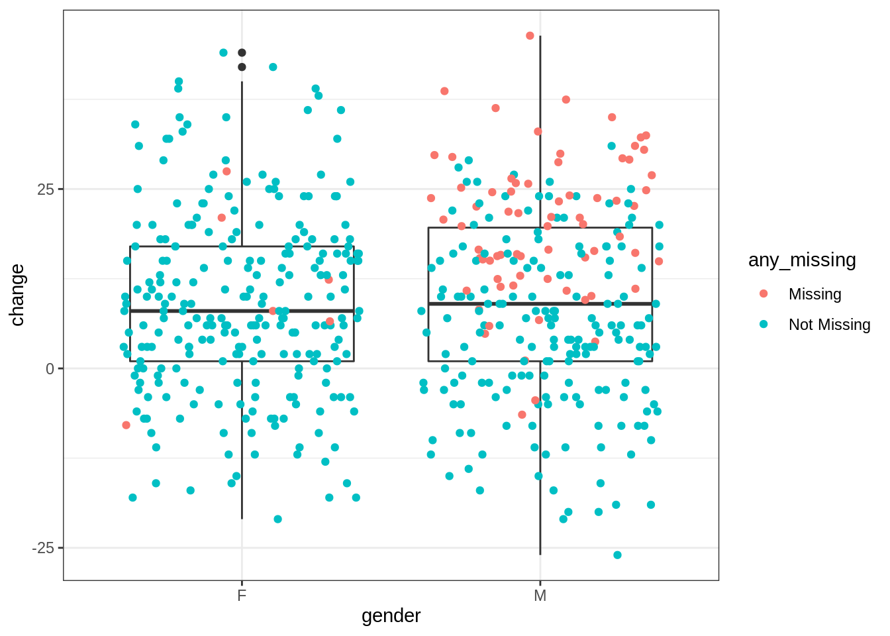

# Dealing with missing data


Missing data can pose serious problems for any data analysis.

<iframe src=" https://www.youtube.com/embed/FT6oYGyWTGY?rel=0 " allowfullscreen width=80% height=350></iframe>

## Example

Let's imagine that we want to analyse the effect of a mentoring programme on boys and girls. For that, they take a test (score1), then experience the mentoring, and then take another test (score2). Let's load the required packages.


```r
pacman::p_load(tidyverse) #As always
pacman::p_load(naniar) #To summarise and visualise missing data
pacman::p_load(simputation) #For imputation of missing data
```

I will simulate the data from our experiment as follows.


```r
set.seed(1234)
results <- data.frame(gender = c(rep("M", 250), rep("F", 250)), 
                      score1 = round(c(rnorm(250, 45, 10), rnorm(250,60,10))), 
                      score2 = round(c(rnorm(250, 55, 10), rnorm(250,70,10))))

results$score2[results$score1<40] <- NA
```

Note that I have assumed that only students who pass the first test (i.e. get at least 40) return to the second test. For all others, that data is missing. What pattern of missingness is that? <select class='solveme' data-answer='["MAR"]'> <option></option> <option>MCAR</option> <option>MAR</option> <option>MNAR</option></select>

`hide("Explanation")`

The data is **missing at random (MAR)** - whether score2 is missing depends on the value of score1, so that it is *not* missing completely at random (MCAR). Whether score2 is missing does not depend on the value of score2 (beyond any association it might have with score1) - therefore it is also *not* missing not at random (MNAR).

`unhide()`

Let's see how much missing data that results in.


```r
miss_var_summary(results)
```

```
## # A tibble: 3 x 3
##   variable n_miss pct_miss
##   <chr>     <int>    <dbl>
## 1 score2       77     15.4
## 2 gender        0      0  
## 3 score1        0      0
```

### Case deletion

15% missing data is quite a lot, but still within the range where scientists might choose to use case deletion and move on.

Given that the data is MAR, do you think that case deletion can bias the results? <select class='solveme' data-answer='["Yes"]'> <option></option> <option>Yes</option> <option>No</option></select>

Let's try case deletion, and test whether the effects on boys and girls are different.


```r
resultsDel <- results %>% na.omit() %>% #Deletes all rows with missing values
                    mutate(change = score2 - score1)

t.test(change ~ gender, resultsDel)
```

```
## 
## 	Welch Two Sample t-test
## 
## data:  change by gender
## t = 3.3375, df = 401.71, p-value = 0.000924
## alternative hypothesis: true difference in means is not equal to 0
## 95 percent confidence interval:
##  1.665645 6.440134
## sample estimates:
## mean in group F mean in group M 
##        9.008197        4.955307
```

Here we would conclude with great confidence (*p* < .001) that the intervention is more effective for girls than for boys. But given that we simulated the data ourselves, we know that the conclusion is false. It just arises because among the boys, the participants with the lowest scores who were most likely to improve (*regression to the mean*) did not show up for the second test. This shows that in such a case, imputation is critical.

### Imputation

For imputation, we need to decide how the missing data should be predicted based on the observed data. Here, it would seem to make most sense to use linear regression to predict score2 from score1. However, before we do that, we need to make sure that we can identify imputed values later on by saving which values were missing to begin with. We use two functions from the `naniar` package for that.


```r
resultsImp <- results %>% bind_shadow(only_miss = TRUE) %>% add_label_missings()

head(resultsImp)
```

```
## # A tibble: 6 x 5
##   gender score1 score2 score2_NA any_missing
##   <chr>   <dbl>  <dbl> <fct>     <chr>      
## 1 M          33     NA NA        Missing    
## 2 M          48     43 !NA       Not Missing
## 3 M          56     62 !NA       Not Missing
## 4 M          22     NA NA        Missing    
## 5 M          49     73 !NA       Not Missing
## 6 M          50     53 !NA       Not Missing
```

`bind_shadow()` has added a new column for each column that had missing values - in this case, `score2_NA` was added, with two values showing whether the value was missing (NA) or not missing (!NA). Without the `only_miss =  TRUE` argument, it would add one 'shadow' column for each column. `any_missing()` added just one new column indicating whether there were any missing values in that row.

Now we can impute the missing data. Functions from the `simputation` package help with that.


```r
resultsImp <- resultsImp %>% group_by(gender) %>% 
  impute_lm(score2 ~ score1, add_residual = "observed") 
```

This tells `simputation` to split the data by gender, calculate a regression to predict score2 from score1 for each gender, use that to impute score2 values and then *add a residual* to each score2 value. The last part is crucial - if we don't do that, then all imputed values will be right on the regression line, which will artificially increase the correlation between score1 and score2 and the fit of any regression model we want to calculate later. `add_residual` can either be `"observed"` or `"normal"`. In the first case, one of the observed residuals is randomly sampled, in the second case, the added residuals follow a normal distribution. I would always recommend `"observed"` as that makes one fewer assumption about the distribution of our data.

Let's see whether the imputed values look reasonable and whether they are different from the observed values in a way that they are likely to influence our results.


```r
resultsImp <- resultsImp %>% mutate(change = score2 - score1)
ggplot(resultsImp, aes(x=gender, y=change)) + geom_boxplot() + geom_jitter(aes(color = any_missing))
```

<div class="figure" style="text-align: center">

<p class="caption">(\#fig:unnamed-chunk-7)Visualisation shows that imputed data matters</p>
</div>

Note that the colour aesthetic is only assigned inside `geom_jitter()`. If it was assigned within `ggplot()`, we would get separate boxplots for observed and imputed values, which is not the aim here.

Looking at the distribution of values that were originally missing and have now been imputed, we can see that the values are generally plausible, in that they fall within the observed range. However, particularly for boys, they are higher than the observed values and are therefore likely to influence our conclusion. 

Let's test again whether there is a difference between boys and girls.


```r
t.test(change ~ gender, resultsImp)
```

```
## 
## 	Welch Two Sample t-test
## 
## data:  change by gender
## t = -0.13676, df = 497.8, p-value = 0.8913
## alternative hypothesis: true difference in means is not equal to 0
## 95 percent confidence interval:
##  -2.459884  2.139711
## sample estimates:
## mean in group F mean in group M 
##        9.062020        9.222106
```

This time, we get the correct result - there is no difference between boys and girls. This shows that when data is MAR (i.e. when missingness depends on other variables we are interested in) we have to consider imputation.

## Further resources

* The [official vignette](https://cran.r-project.org/web/packages/naniar/vignettes/getting-started-w-naniar.html) for `naniar` provides provides good step-by-step instructions for exploring and visualising missing data
* Similarly, the [official vignette](https://cran.r-project.org/web/packages/simputation/vignettes/intro.html) for `simputation` contains details on how to use different imputation models and how to impute several variables at once
