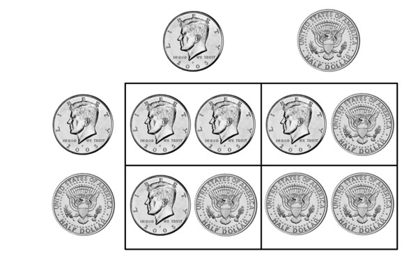

# Probability in statistics and real life

```{r setup, include = FALSE}
pacman::p_load(webex)
```

Much of statistics (namely *inferential* statistics) is about probability. Based on the data we have, is it likely that our hypothesis is true? But much of our other work as scientists, and much of everyday life, is also about probabilities. To be able to evaluate scientific claims, as well as news reporting and a range of other situations in life, it helps to have a basic understanding of probability. By the end of this, you should be able to find an answer to questions like the following:

* How big does a group need to be until it is 95% likely that two of them share a birthday?
* Should it be news that a village in Poland has not seen a single boy being born in a decade?
* How likely is it that someone has breast cancer when they receive a positive mammogram result?

## What are probabilities?

There is still a lot of technical disagreement on definitions in this area. However, for our purposes, we just need to distinguish three concepts: procedures, events and probabilities. *Procedures* are anything that generates data - from rolling a die and writing down the number to conducting a medical test or surveying 500 people and calculating the mean on some outcome. An *event* is the result of a procedure, be that a 3 on a die or a positive result on a medical test. Finally, the *probability* expresses the likelihood with which an unobserved event will occur. Probabilities thereby offer guidance as to a reasonable degree of belief.

Probabilities can be based on experience and inference. I can count how often it rains later in the day when I wake up to a grey sky; if I do that for long enough and calculate the share of days when it rained as a total of all days I observed, this will give me a good guidance regarding the probability of rain. Weather forecasting apps do something a bit more sophisticated, but still quite similar.

Alternatively, we can use a more formal and logical way to find probabilities. This involves counting the number of possible outcomes of our procedure, and the number of possible outcomes that would lead to the event we are interested in. Probabilities are then expressed as fractions, dividing the number of ways in which our specified event can occur by the total number of outcomes. For example, the probability of rolling a 3 with a die is $\frac{1}{6}$, as there are 6 possible outcomes, and only one of them results in a three. Rolling an even numbers, on the other hand, has a probability of $\frac{3}{6}$ (or $\frac{1}{2}$) as there are now 3 out of 6 possible outcomes that lead to the event we are interested in.

Over to you - what is the probability of rolling a number smaller than 5?  `r mcq(c("2/6 or 1/3", "3/6 or 1/2", answer = "4/6 or 2/3"))`

These fractions can often be expressed more easily by a percentage. The probability of rolling an odd number is $\frac{3}{6}$ or 50%.

What is the probability of pulling a red card from a standard deck of cards, in percent?  `r fitb(c("50", "50%", "50 %"), ignore_case = TRUE)`

Finally, probabilities can range from 0 (0 %) to 1 (100 %) - an event with a probability of 0 is impossible, one with a probability of 1 is inevitable. 

## Combining multiple events together

Often we are interested in more than one possible outcome. So what is the probability of rolling an even number *or* a 3 with a die? We already know that it is $\frac{3}{6}$ for an even number and $\frac{1}{6}$ for a 3. So the probability for either of them to occur is $\frac{4}{6}$ - we can add them up. 

However, what is the probability of rolling a 3 *or* an odd number? The probability for rolling an odd number is $\frac{3}{6}$, and the probability for rolling a 3 is $\frac{1}{6}$. Can we add them up? Remember that probabilities are the ways in which the event we are interested in can occur, divided by the total number of outcomes. Here, those are three ways (1, 3 and 5) of the possible six outcomes of rolling a die. Since rolling a 3 satisfies both sides of our *or* statement, we must not double count it.

As a shorthand, we can write $P(A)$ to mean the probability of event A. Formally, the probability of either of two events occurring is
$P(A or  B)=P(A)+P(B)-P(AandB)$

Over to you - what is the probability of getting a King or Queen when you draw a card from a standard deck of cards (52 cards)?  `r mcq(c("4/52 or 7.5 %", answer = "8/52 or 15%", "16/52 or 30%"))`

`r hide("I need a hint")`
Consider the total number of possible results as well as the possible number of ways you can get a King or a Queen
`r unhide()`

`r hide("Give me the explanation")`
$P(King)$ is $\frac{4}{52}$ because there are 4 Kings among the 52 cards. Likewise, $P(Queen)$ is $\frac{4}{52}$ because there are 4 Queens. There is no card that is both a King and a Queen, so that we can just add up the probabilities and thus arrive at $\frac{8}{52}$
`r unhide()`


One more - what is the probability of getting a red card or a King or Queen when you draw a card from a standard deck of cards (52 cards)?  `r mcq(c("26/52", answer = "30/52",  "34/52"))`

`r hide("I need a hint")`
This time, there is a risk of double-counting. Avoid doing that.
`r unhide()`

`r hide("Give me the explanation")`
$P(KingorQueen)$ is $\frac{8}{52}$, while $P(Red)$ $\frac{26}{52}$. However, there are 2 red Kings and 2 red Queens that are counted in both probabilities - therefore, we can get a red card or a King or a Queen in only 30 rather than 34 ways.
`r unhide()`

## Looking at independent events

We are always interested in patterns that emerge when we look across multiple events. If we keep on tossing a coin, what is the probability to get two heads in a row? We can again count the number of possible outcomes versus the number of ways in which our event can occur.

```{r img-coins, echo=FALSE, fig.cap="Results of two coin tosses"}



```

As you can see in the figure, there are four possible outcomes, only one of which results in two heads, so that the probability for that is $\frac{1}{4}$ or 25%. What about four coins in a row turning up head? We know that there is only one way in which that can happen, but how many outcomes are there in total? We have seen that 2 coins result in four outcomes. Now tossing a third coin results in two possibilities for each of these 4 outcomes so far, turning them into 8. Tossing a fourth coin results in 16. (If you can't see the pattern, try to draw out the possibilities - it will help.). So the probability for four heads in a row is $\frac{1}{16}$ or about 6%

The probability of two events both occurring in sequence is $P(A)*P(B)$. That implies that the probability of the same event occurring n times in a row is $P(A)^n$. 

Over to you - if you assume that 50% of babies born are girls, what is the probability of a woman to give birth to three girls in a row?  `r mcq(c(answer = "1/8 or 12.5%", "1/3 or 33 %", answer = "1/2 or 50%"))`

`r hide("Give me the explanation")`
The probability for the first child to be a girl is 50% ($\frac{1}{2}$). For the second it is 50% as well. If we multiply them, we get 25%($\frac{1}{4}$). The third child again has a 50% chance of being a girl. Multiplying 25% by 50% results in 12.5% ($\frac{1}{8}$). 
`r unhide()`

Quite often we are interested in the **likelihood of something occurring at least once,** rather than on every attempt. So we might want to know how likely it is that a family with three children has at least one boy among them. Assuming that gender is binary, that is the same as saying that they do not have three girls. Given that they either have 3 girls or at least one boy, we know that these probabilities add up to 1 (certainty) - such events are known as *complementary* events. Therefore, the probability of having at least one boy is 1 - 12.5% = 77.5%

Remembering that **something happening at least once is the *complement* of it never happening** is very helpful, because it is much easier to calculate the chance of something never happening across a given number (n) of procedures. It is $P(notA)^n$. We have already discussed this in the context of multiple comparisons. 

Over to you. If the chance of finding a false positive is 5% on each attempt, what is the chance of finding a false positive in at least one of seven tests? For that, you will need a calculator. Note that $x^n$ should be entered as `x^n` in R or the Google search box. Enter your answer in percent, rounded to the nearest whole number: `r fitb(c("30", "30%", "30 %"), ignore_case = TRUE)`

`r hide("I need a hint")`
The answer is 100% minus the probability of not getting a false positive 7 times in a row.
`r unhide()`

`r hide("Give me the explanation")`
The probability of not getting a false positive is 95%, so if we try that 7 times in a row, we get a probability of
$0.95^7=0.70$ of getting *no* false positives. Given that getting at least one false positive is the complementary event to this, the chances of that are 100% - 70% = 30%
`r unhide()`

## Updating our beliefs - Bayes' theorem

What you have looked at so far are the basic rules of probability that are good to remember (and that you might have seen a while ago in school). So far, we have treated probabilities as something abstract: we think about a situation, or collect data, and then assign a probability. In reality, that is not how it works. We rather use the probabilities of events to update our present beliefs. For example, if I leave my front door and see that the street is wet, I use that to update my belief (i.e. the probability I believe in) about whether it has rained earlier in the day, but in a way that depends on more than just the fact that the street is wet.

To explore how such an updating of beliefs is done, we are making quite a far jump to Bayes' theorem. You do not need to remember the formula, but the intuition is important. A key part of it are conditional probabilities - the probability of an event given that another event has occurred. We have worked with one kind of them extensively - *p*-values. They are the probability of getting the observed data, or data that is more extreme, if the null hypothesis is true. This can be written as $P(O|H_0)$

What Bayes' theorem reveals is how we can link that probability to the probability we are actually interested in, namely the probability that the hypothesis is true, given the data. In statistics, we often slip from one in the other, but if we think about examples, it becomes clear that they are not the same. For example, $P(StreetWet|Rained)\neq P(Rained|StreetWet)$. With regard to the first part, it is very likely that the street is wet if it has rained. However, whether it is likely that it has rained if the street is wet depends on other factors - and those factors are what Bayes' theorem adds to our thinking. It suggests that

$P(Rained|StreetWet) = \frac{P(StreetWet|Rained)*P(Rained)}{P(StreetWet)}$

So, my belief whether is has rained given that the street is wet should be based on the probability that the street is wet *if* it has rained, but also on the probability I could assign to rain before I got that information, and the probability that the street is wet regardless of rain. If I saw beautiful sunshine through the window all day long, my belief for $P(Rained)$ might be very low, so that I would probably not give a high value to $P(Rained|StreetWet)$. Similarly, if the street in front of my house is wet all the time due to a broken pipe (high ${P(StreetWet)}$), I would not give a high value to $P(Rained|StreetWet)$.

Thinking in this way can help to interpret probabilistic results. A frequently used example (Gigerenzer and Hoffrage, 1995) goes as follows:

>The probability of breast cancer is 1% for women aged forty who participate in routine screening. If a woman has breast cancer, the probability is 80% that she will get a positive mammogram. If a woman does not have breast cancer, the probability is 9.6% that she will also get a positive mammogram. A woman in this age group has a positive mammogram in a routine screening. What is the probability that she actually has breast cancer?

What do you think? Type your *estimate* into this box before you read on, rounded to the nearest percent: `r fitb(c("8", "8%", "8 %"), ignore_case = TRUE)`

Let's think what would happen to 10,000 women who participate in the screening. We would expect that 100 of them will have breast cancer, and 80% of them will be tested positive, resulting in 80 true positives. Out of the remaining 9,900, 9.6% will also test positive, resulting in 950 false positives. So only 80 of 80+950=1030 positive tests are true positives, so that a woman who tests positive has a 7.6% chance of actually having breast cancer.

Over to you - let's assume a woman who has just tested positive goes through another mammogram and tests positive again. What is the probability now that she actually has breast cancer? (Hint: start with 10,000 women again - only one of the numbers changed compared to the example above.) Again, enter the number rounded to the nearest percent: `r fitb(c("41", "41%", "41 %"), ignore_case = TRUE)`


`r hide("Give me the explanation")`
This time, out of 10,000 women, 7.6% would have breast cancer, so 760. 80% of them would test positive, resulting in 608 true positives. Out of the remaining 9,240 women, 9.6% would test positive even though they do not have breast cancer, resulting  in 887 false positives. So this time round, 608 of 1,495 positive tests would be true positives (41%), which shows that the chance of having breast cancer increases to 41% after two positive tests. 
`r unhide()`

The key message for evaluating the results of statistical tests, as well as any other tests, is that it helps to think about *prior probabilities.* If a hypothesis is very implausible, then even data that is only likely if that hypothesis was true should not cause us to entirely forget our informed (!) previous beliefs. Rather we should think about how to shift them.

**Bayesian statistics** starts from this idea, and has developed into a whole different approach to statistical inference. Unlike frequentist statistics (which we have focused on), it does not consider hypothetical repeated experiments  to test whether data is inconsistent with a specific null hypothesis. Instead, it tries to use the data we actually obtain  to shift our estimates of specific parameters. A big barrier to its wide-spread adoption is that it only adds a lot of value if it uses specific prior probabilities, which can be hard to obtain and justify - why would a specific hypothesis have a prior probability of being true of 8% rather than 1%? (And you have seen above what a difference that makes for our belief after we have obtained new evidence.) One surprisingly powerful way around that is to survey experts ... but this is all material for your own further study or a more advanced course. As a starting point, you can have a look at the first presentation linked to under Further Resources. 

## Further resources

* This [presentation](http://faculty.washington.edu/kenrice/BayesIntroClassEpi2018.pdf){target="_blank"} provides a fairly brief introduction to Bayesian statistics
* Examples like the one regarding the breast cancer screening have led to lots of discussion about how to communicate the reliability of medical tests in a way that patients (and policy makers) understand. This article by [Navarette et al. (2015)](https://www.ncbi.nlm.nih.gov/pmc/articles/PMC4585185/){target="_blank"} goes through some further interesting examples and ways of presenting information and highlights why mass screenings are often not helpful.